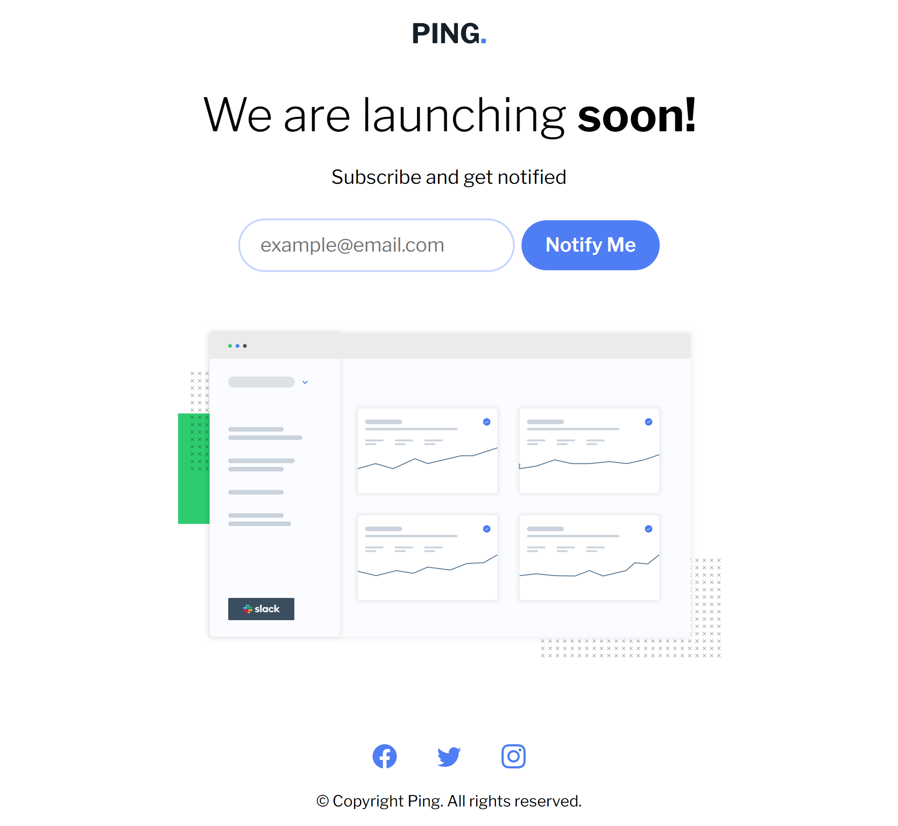
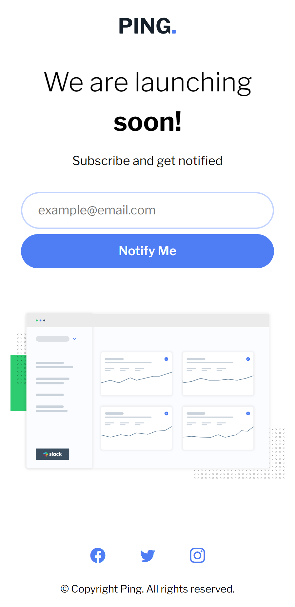

# Ping Landing Page

This is a solution to the **Ping Landing Page** Challenge from [Frontend Mentor](https://frontendmentor.io)

- [Ping Landing Page](#ping-landing-page)
  - [Preview](#preview)
    - [Desktop](#desktop)
      - [Default](#default)
      - [Error](#error)
      - [Success](#success)
    - [Mobile](#mobile)
      - [Default](#default-1)
  - [Tools and Languages](#tools-and-languages)
    - [Tools](#tools)
    - [Languages](#languages)
  - [Process](#process)
    - [Create a Vite application](#create-a-vite-application)
    - [Build the app for production](#build-the-app-for-production)
    - [Preview](#preview-1)
  - [What I Learned](#what-i-learned)
    - [Steps](#steps)
  - [Links](#links)

## Preview

Preview images for the website

### Desktop

#### Default



#### Error


#### Success


### Mobile

#### Default



## Tools and Languages

### Tools

- [Visual Studio Code](https://code.visualstudio.com)
- [Vite](https://vitejs.dev)
- [Validator](https://www.npmjs.com/package/validator)
- [Mozilla Firefox](https://mozilla.org/firefox)
- [Brave](https://brave.com)
- Git
- GitHub

### Languages

- HTML
- CSS
- JavaScript

## Process

### Create a Vite application

```sh
npm create vite@latest -- --template vanilla app
```

This creates a Vite application inside a folder called `app`

```sh
cd app
```

Change the working directory into the `app` directory

```sh
npm install
```

This will install all the required dependencies

```sh
npm run dev
```

### Build the app for production

Once everything's done and you're ready to publish your website to the internet, build it for production.

```sh
npm run build
```

this will bundle the files and assets

### Preview

Then to check if everything works as expected, run a preview of the website

```sh
npm run preview
```

## What I Learned

This project helped me get familiar with the Validator library. I have never tried it before. The excellent documentation on the npm website helped me use it with ease.

### Steps

```sh
npm install validator
```

```js
import validator from "validator";
import isEmail from "validator/lib/isEmail";
```

Then get the value of the input that you're validating.

```js
const emailInput = document.querySelector("#emailInput");

if (!validator.isEmail(emailInput.value)) {
  // error code
} else {
  // success code
}
```

This might not be the "best" way to implement this. But, as someone who is just getting started with JavaScript, this is a huge achievement for me.

## Links

- [GitHub](https://github.com/Code-Beaker/ping-landing-page-production)
- [Vercel Deploy](https://ping-landing-page-code-beaker.vercel.app/)
